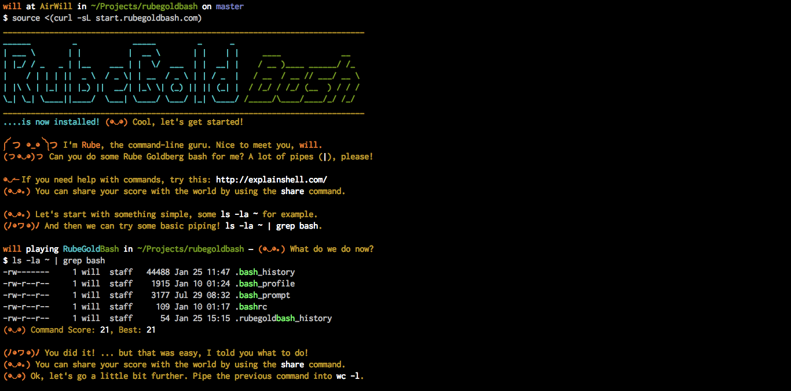

[RubeGoldBash](http://www.rubegoldbash.com) 
==============

~~~
______         _            _____         _      _                           
| ___ \       | |          |  __ \       | |    | |    ____             __   
| |_/ / _   _ | |__    ___ | |  \/  ___  | |  __| |   / __ )____ ______/ /_  
|    / | | | ||  _ \  / _ \| | __  / _ \ | | / _  |  / __  / __ // ___/ __ \ 
| |\ \ | |_| || |_) ||  __/| |_\ \| (_) || || (_| | / /_/ / /_/ (__  ) / / / 
\_| \_| \____||____/  \___| \____/ \___/ |_| \____//_____/\____/____/_/ /_/  
(っ◕‿◕)っ is an awesome game!
~~~

> A command-line quest where your goal is to invent Rube Goldberg machines in bash! Create the longest one-liners you can, the more pipes (|) the better.
> Master Rube ((◕‿◕) Hi there!) will help you during your quest.

- View the [RubeGoldBash website!](http://www.rubegoldbash.com)
- Look at the [RubeGoldBash High Scores!](http://highscore.rubegoldbash.com)

## Getting Started

First open your favorite prompt, and then:

~~~bash
bash
source <(curl -sL start.rubegoldbash.com)

# Use share to submit your score:
share
# Use exit to stop RubeGoldBash
exit
~~~

### Requirements

Here is the list of requirements for the game to run on your system:

- `bash`
- `python`
- `curl`
- `say`

## Look, screnshot!

## Built with

- A lot of Bash
- ASCII Art!
- Some Node, Express, MongoDB

- http://heroku.com/
- http://simplybuilt.com/
- https://github.com/thibweb/dotfiles

### Online services

- http://commandlinefu.com/
- http://www.yodaquotes.net/
- http://ip.appspot.com/
- http://whenwillitbedone.trgdy.com/
- http://translate.google.com/
- http://ifconfig.me/
- http://openweathermap.org/
- http://freegeoip.net/

### Command line

- http://patorjk.com/software/taag/#p=display&h=2&v=1&f=Slant&t=RubeGoldBash
- https://github.com/olizilla/asciify
- https://github.com/maxogden/cool-ascii-faces

## Related

### Main concept

- https://en.wikipedia.org/wiki/Rube_Goldberg_machine
- https://en.wikipedia.org/wiki/Unix_philosophy
- https://en.wikipedia.org/wiki/Turboencabulator
- http://blog.codinghorror.com/rube-goldberg-software-devices/

### Games

- https://github.com/mprat/Terminus
- https://xss-game.appspot.com/
- https://github.com/Gazler/githug
- https://alexnisnevich.github.io/untrusted/
- http://www.mobygames.com/game/dos/incredible-machine

### Videos

- https://www.youtube.com/watch?v=_ve4M4UsJQo
- https://www.youtube.com/watch?v=H6wXKVpWWHY

## Contributing

- [High Score server repository](https://github.com/ThibWeb/rubegoldbash-server)

## Examples of RubeGoldBash (SPOILERS!)

~~~bash
# Retrieve the weather for your location
curl -s ip.appspot.com | xargs -n 1 curl -s "freegeoip.net/csv/$1" | cut -d ',' -f '9 10' | sed 's/,/\&lon=/g' | xargs -n 1 echo "http://api.openweathermap.org/data/2.5/weather?mode=html&lat=$1" | sed 's/ //g' | xargs -n 1 curl -s $1 | tee weather.html
# Same request, with display to the prompt using lynx
curl -s ip.appspot.com | xargs -n 1 curl -s "freegeoip.net/csv/$1" | cut -d ',' -f '9 10' | sed 's/,/\&lon=/g' | xargs -n 1 echo "http://api.openweathermap.org/data/2.5/weather?mode=html&lat=$1" | sed 's/ //g' | xargs -n 1 curl -s $1 | lynx -stdin -dump

# Retrieve the answer to "When will it be done?" (scraping) and make a nice voice read it for you.
lynx --dump whenwillitbedone.trgdy.com | head -n 8 | tail -n 4 | tr "\\n" ' ' | cut -d '[' -f 1 | sed 's/   //g' | sed "s/'/ /g" | perl -pe 's/([^a-zA-Z0-9_.!~*()'\''-])/sprintf("%%%02X", ord($1))/ge' | xargs -n 1 echo "http://translate.google.com/translate_tts?ie=UTF-8&tl=en&q=$1" | sed 's/ //g' | xargs -n 1 curl -s "$1" > whenwillitbedone.mp3
# File can be read with
afplay whenwillitbedone.mp3

# Count the number of folders in the current working directory.
ls -l | cut -c 1 | grep d | wc -l

# Find the longest name
cat /usr/share/dict/propernames | grep 'S' | awk '{print length($1), $1}' | sort -n | tail -n 1 | cut -d ' ' -f 2
# And spell it
cat /usr/share/dict/propernames | grep 'S' | awk '{print length($1), $1}' | sort -n | tail -n 1 | cut -d ' ' -f 2 | say
~~~
